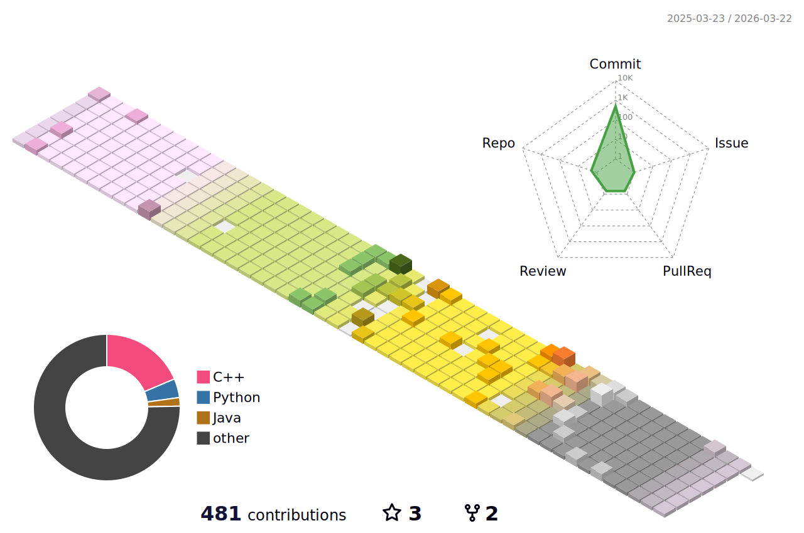

# Yushin Kim, A Fast Developer

### Weekly Coding Time 💻

<!--START_SECTION:waka-->

```txt
From: 20 August 2024 - To: 27 August 2024

Total Time: 33 hrs 19 mins

TypeScript   17 hrs 8 mins   █████████████░░░░░░░░░░░░   51.42 %
Markdown     6 hrs 56 mins   █████▒░░░░░░░░░░░░░░░░░░░   20.84 %
C++          3 hrs 28 mins   ██▓░░░░░░░░░░░░░░░░░░░░░░   10.44 %
JavaScript   2 hrs 16 mins   █▓░░░░░░░░░░░░░░░░░░░░░░░   06.81 %
Other        2 hrs 4 mins    █▓░░░░░░░░░░░░░░░░░░░░░░░   06.22 %
```

<!--END_SECTION:waka-->

### Annual Contributions 🏃


