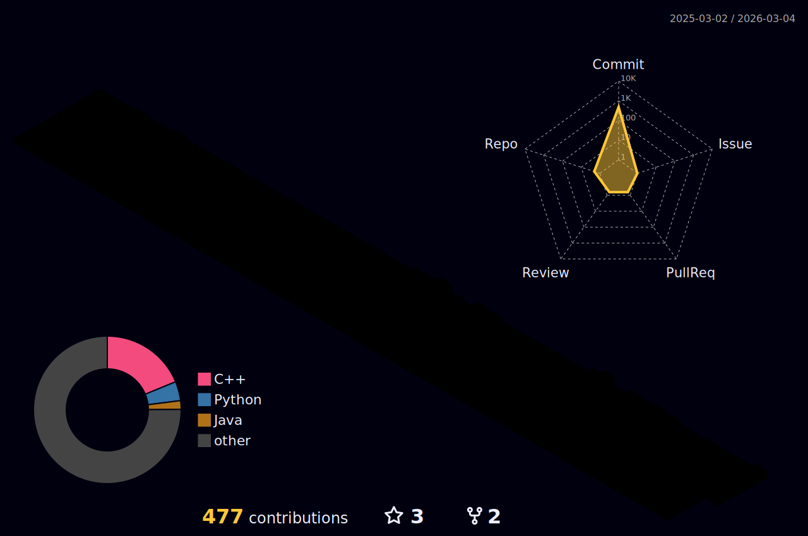

# Yushin Kim, A Fast Developer

## Weekly Coding Time 💻

<!--START_SECTION:waka-->

```txt
From: 29 March 2025 - To: 05 April 2025

Total Time: 4 hrs 12 mins

C++        3 hrs 33 mins   █████████████████████░░░░   84.54 %
Python     35 mins         ███▓░░░░░░░░░░░░░░░░░░░░░   14.08 %
Markdown   3 mins          ▒░░░░░░░░░░░░░░░░░░░░░░░░   01.39 %
```

<!--END_SECTION:waka-->

## Annual Contributions 🏃



## Problem solving 👨‍💻

<div align="center">

[](https://solved.ac/kys010306)


</div>
