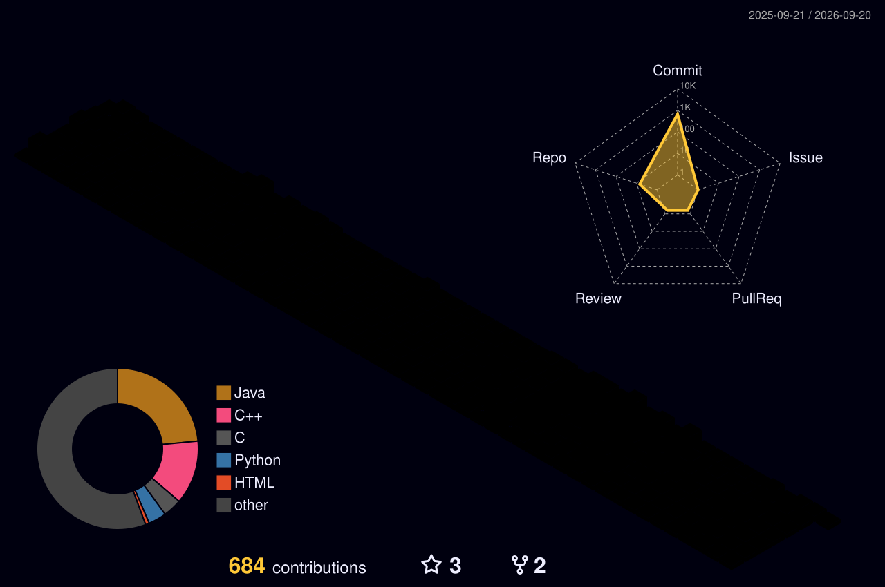

# Yushin Kim, A Diligent Developer

## Weekly Coding Time 💻

<!--START_SECTION:waka-->

```txt
From: 31 May 2026 - To: 07 June 2026

Total Time: 16 hrs 42 mins

Markdown          7 hrs 52 mins         ⣿⣿⣿⣿⣿⣿⣿⣿⣿⣿⣿⣷⣀⣀⣀⣀⣀⣀⣀⣀⣀⣀⣀⣀⣀   47.14 %
Java              5 hrs 36 mins         ⣿⣿⣿⣿⣿⣿⣿⣿⣤⣀⣀⣀⣀⣀⣀⣀⣀⣀⣀⣀⣀⣀⣀⣀⣀   33.60 %
TypeScript        2 hrs 8 mins          ⣿⣿⣿⣄⣀⣀⣀⣀⣀⣀⣀⣀⣀⣀⣀⣀⣀⣀⣀⣀⣀⣀⣀⣀⣀   12.83 %
Other             15 mins               ⣤⣀⣀⣀⣀⣀⣀⣀⣀⣀⣀⣀⣀⣀⣀⣀⣀⣀⣀⣀⣀⣀⣀⣀⣀   01.55 %
```

<!--END_SECTION:waka-->

## Annual Contributions 🏃



## Problem solving 👨‍💻

[](https://solved.ac/kys010306)
