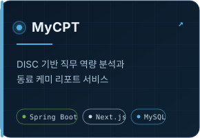
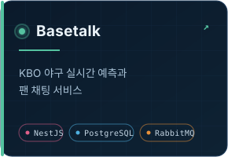
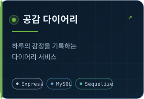

# 🚀 You've just arrived at Yushin Kim's GitHub



<p align="center">
  <b>Design, Documentation, and Development</b> · "철저한 설계와 문서화를 통해 최종 산출물의 신뢰도를 보장한다."
</p>

## Recent Projects 🧩

<p align="center">
  <a href="https://github.com/Yush1nk1m/MyCPT"></a>
  &nbsp;
  <a href="https://github.com/Yush1nk1m/MAT4331-backend"></a>
  &nbsp;
  <a href="https://github.com/Yush1nk1m/Empathy_Diary"></a>
</p>

## Weekly Coding Time 💻

<!--START_SECTION:waka-->

```txt
From: 24 June 2026 - To: 01 July 2026

Total Time: 17 hrs 50 mins

Java              12 hrs 28 mins        ⣿⣿⣿⣿⣿⣿⣿⣿⣿⣿⣿⣿⣿⣿⣿⣿⣿⣦⣀⣀⣀⣀⣀⣀⣀   69.87 %
Markdown          2 hrs 23 mins         ⣿⣿⣿⣤⣀⣀⣀⣀⣀⣀⣀⣀⣀⣀⣀⣀⣀⣀⣀⣀⣀⣀⣀⣀⣀   13.38 %
TypeScript        2 hrs 5 mins          ⣿⣿⣿⣀⣀⣀⣀⣀⣀⣀⣀⣀⣀⣀⣀⣀⣀⣀⣀⣀⣀⣀⣀⣀⣀   11.75 %
SQL               28 mins               ⣶⣀⣀⣀⣀⣀⣀⣀⣀⣀⣀⣀⣀⣀⣀⣀⣀⣀⣀⣀⣀⣀⣀⣀⣀   02.67 %
PlantUML          17 mins               ⣤⣀⣀⣀⣀⣀⣀⣀⣀⣀⣀⣀⣀⣀⣀⣀⣀⣀⣀⣀⣀⣀⣀⣀⣀   01.63 %
Java Properties   2 mins                ⣀⣀⣀⣀⣀⣀⣀⣀⣀⣀⣀⣀⣀⣀⣀⣀⣀⣀⣀⣀⣀⣀⣀⣀⣀   00.28 %
Properties        1 min                 ⣀⣀⣀⣀⣀⣀⣀⣀⣀⣀⣀⣀⣀⣀⣀⣀⣀⣀⣀⣀⣀⣀⣀⣀⣀   00.11 %
Other             0 secs                ⣀⣀⣀⣀⣀⣀⣀⣀⣀⣀⣀⣀⣀⣀⣀⣀⣀⣀⣀⣀⣀⣀⣀⣀⣀   00.04 %
```

<!--END_SECTION:waka-->

## Annual Contributions 🏃


## Problem Solving 👨‍💻

[](https://solved.ac/kys010306)
