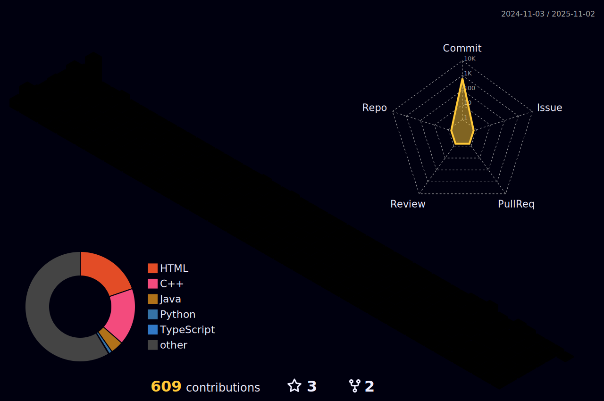

# Yushin Kim, A Fast Developer

## Weekly Coding Time 💻

<!--START_SECTION:waka-->

```txt
From: 08 August 2025 - To: 15 August 2025

Total Time: 4 hrs 5 mins

Java     3 hrs 38 mins   ██████████████████████▒░░   89.17 %
Python   22 mins         ██▒░░░░░░░░░░░░░░░░░░░░░░   08.98 %
C        4 mins          ▒░░░░░░░░░░░░░░░░░░░░░░░░   01.85 %
```

<!--END_SECTION:waka-->

## Annual Contributions 🏃



## Problem solving 👨‍💻

<div align="center">

[](https://solved.ac/kys010306)


</div>
